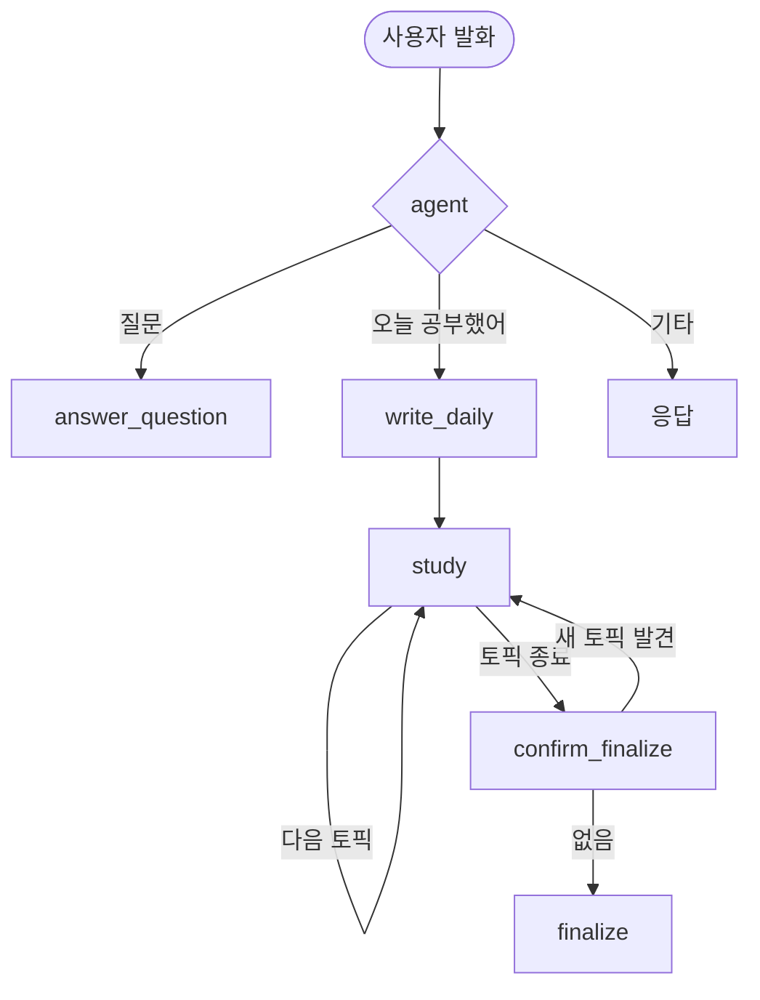
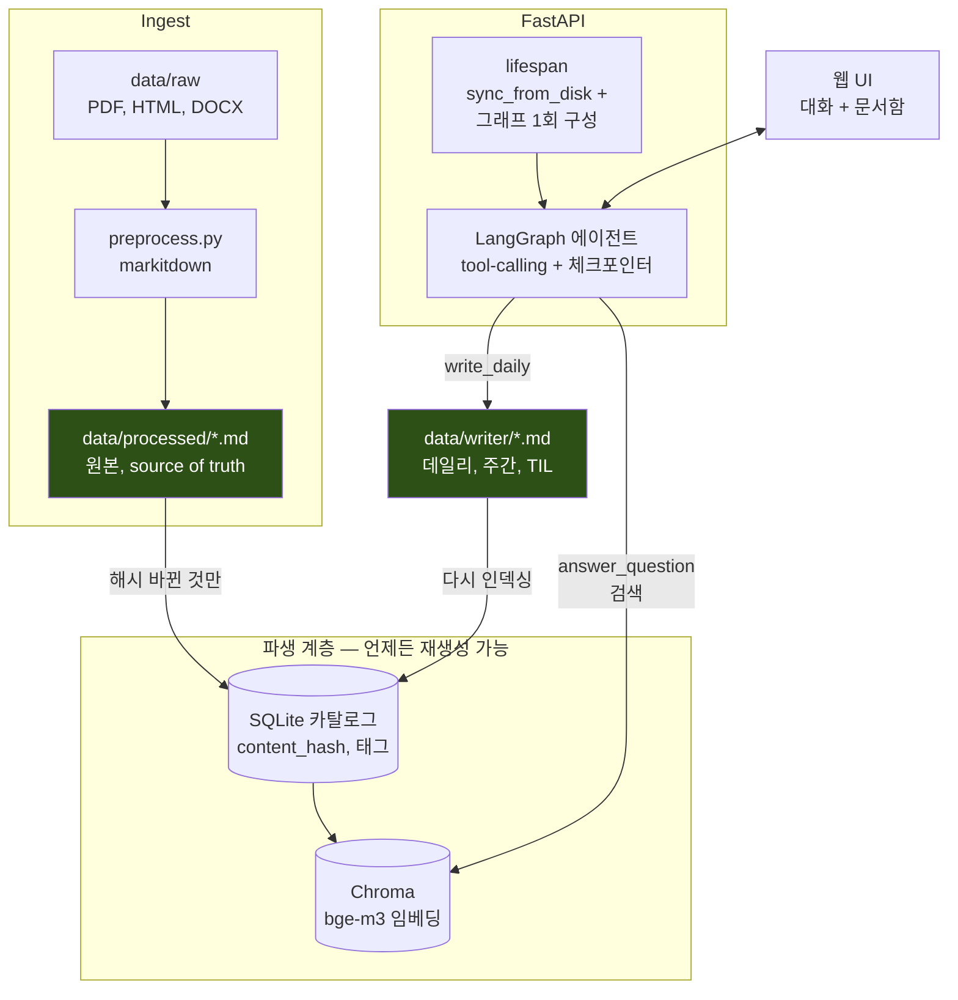

# Knowledge Gardener


> **요약해주는 AI는 학습을 대신해준다.** Knowledge Gardener는 요약하지 않고 되묻는다.

<!-- TODO: 데모 img -->

```
🧑 오늘 Transformer 공부했어. 정리해줘.

일반적인 AI:
🤖 Transformer는 Self-Attention을 사용하는...

Knowledge Gardener:
🤖 Transformer를 본인 말로 설명해주실 수 있나요?

🧑 각 단어 사이의 관련도를 계산하는...

🤖 왜 관련도를 계산해야 하나요?
   순서대로 처리하면 안 되는 이유는 뭘까요?
```

설명해낸 내용은 학습 노트로 저장하고,

설명하지 못한 개념은 **🌱 다시 꺼내볼 것(seedling)** 으로 남긴다.

이 기록은 다시 Knowledge Base에 편입되어 이후 질문의 검색 근거가 된다.

---

## Why

대부분의 AI 학습 도구는 사용자가 설명하기 전에 **답부터 알려준다.**

하지만 교육학 연구(Dunlosky et al., 2013)는

- **Retrieval Practice (인출 연습)**
- **Spaced Repetition (분산 복습)**

은 높은 학습 효과를 보이고,

- 요약
- 재독

은 상대적으로 효과가 낮다고 보고한다.

그래서 Knowledge Gardener는

> **"요약을 잘하는 AI"가 아니라 "설명하게 만드는 AI"**

를 목표로 설계했다.

### Design Principles

| 원칙 | 시스템에서 어떻게 강제했는가 |
|------|---------------------------|
| 요약 생성 경로 제거 | `write_daily`는 질문만 생성하며, 답은 절대 생성하지 않는다. |
| 추측 생성 금지 | 설명하지 못한 내용은 채우지 않고 `🌱 seedlings`에만 기록한다. |
| 얕은 이해 차단 | 설명이 피상적이면 반드시 후속 질문을 생성한다. |
| 임의 종료 방지 | 마지막 토픽에서도 저장하지 않고 반드시 사용자 확인을 거친다. |

---

## 인출 루프

인출연습은 한 번의 질문으로 끝나지 않는다.

사용자의 답변에 따라 추가 질문을 하거나, 다음 토픽으로 넘어가거나, 저장 여부를 확인해야 한다.
Knowledge Gardener는 이 흐름을 **LangGraph 기반의 상태 전이(State Transition)** 로 관리한다.

이 과정에서 학습 세션은 네 가지 상태를 오가며 진행된다.

- **pending** : 아직 설명하지 않은 토픽
- **answered** : 충분히 설명한 토픽
- **seedlings** : 다시 복습할 토픽
- **awaiting_finalize** : 저장 여부를 확인하는 단계



`answer_question`은 검색 점수가 낮으면 질문을 다시 작성해 최대 2회까지 재검색한다.

검색 근거가 충분하지 않다면 답을 생성하기보다, 먼저 근거를 확보하도록 설계했다.

---

## 아키텍처



---

## 기술 스택

| 영역 | 선택 | 채택 근거 |
|---|---|---|
| 에이전트 | LangGraph `StateGraph` + tool-calling + 체크포인터 | 조건 분기와 멀티턴 상태는 단일 체인(LCEL)으로 표현할 수 없다 |
| 전처리 | [markitdown](https://github.com/microsoft/markitdown) + Markdown Header Splitter | 형식을 통일하고, 헤더 단위로 쪼개 검색 시 섹션 의미를 보존한다 |
| 인덱스 | SQLite 카탈로그(`content_hash`) + ChromaDB | 변경 감지와 태그는 SQL로, 유사도는 벡터로 — 둘 다 `.md`에서 재생성 가능한 파생 데이터다 |
| 임베딩 | 로컬 `BAAI/bge-m3` | API 무료 한도를 넘어 로컬로 전환 |
| LLM | 생성: Cerebras `gemma-4-31b` → (폴백) Claude `Haiku 4.5`<br>판정: Claude `Sonnet 5` | 판정 오류는 사용자 경험에 직접 영향을 주기 때문에, Generation보다 Judge에 더 높은 성능의 모델을 사용했다 |
| 서빙 | FastAPI, `lifespan`에서 그래프 1회 구성 | 요청마다 그래프를 새로 만들지 않는다 |
| 관측 | LangSmith 추적 + 요청별 `elapsed_ms` 로깅 | Trace 및 Latency 분석 |
| 배포 | Docker + Compose + EC2 | 앱과 Chroma를 서비스로 분리, named volume, EC2용 compose 별도 |

---

## 실행

```bash
# Docker (권장)
cp .env.example .env          # 실제 키 입력, 커밋 금지
docker compose up --build     # app(:8080) + chroma(:8000)

# 로컬 개발
uv sync
cp .env.example .env
uv run python scripts/preprocess.py   # data/raw/* → data/processed/*.md
uv run fastapi dev app/main.py        # http://localhost:8000
```

별도 인덱싱 명령은 없다

서버 시작 시 카탈로그가 디스크와 동기화되고(`sync_from_disk`), 해시가 바뀐 문서만 자동 재임베딩된다(`sync_index`).

---

## 프로젝트 구조

```
app/
├── main.py               # lifespan에서 sync_from_disk() + 에이전트 그래프 1회 구성
├── api/routes/           # POST /converse, GET /threads/{id}, 문서 카탈로그 CRUD
├── rag/
│   ├── graph.py          # QA 그래프(재검색 루프) / 에이전트 그래프(인출연습 상태 기계)
│   ├── nodes.py          # retrieve, generate, grade_docs, rewrite_query / study, finalize, confirm
│   ├── study_session.py  # 인출연습 상태 전이 — 순수 함수, LLM 없이 테스트
│   ├── tools.py          # answer_question, write_daily, write_weekly, write_til, visualize_mindmap
│   └── chain.py          # 임베딩, 벡터스토어, LLM 빌더, 폴백 체인, sync_index
├── core/catalog.py       # SQLite 카탈로그 — content_hash, prune_missing, 태그
├── writer/               # 노트 저장 (프론트매터 + 인출연습 프롬프트)
└── services/, schemas/, visualizer/
scripts/
├── preprocess.py         # data/raw → markitdown → data/processed
├── eval_retrieval.py     # 검색 평가 + threshold 스윕
└── baseline.py           # LangSmith 엔드투엔드 평가
static/                   # 웹 UI (대화 + 문서 리더)
```

---

## 로드맵

| 계획 | 이유 |
|---|---|
| 문서 업로드 API | 원격 배포 환경에서도 브라우저만으로 문서를 추가할 수 있도록 인제스트 경로 확장 |
| 하이브리드 검색 (BM25 + Dense) | Dense Retrieval이 놓치는 키워드 기반 검색을 보완하고 Retrieval 성능 향상 |
| Retrieval 평가 결과 공개 | Hit Rate, MRR 등 검색 품질 지표를 공개해 튜닝 과정을 재현 가능하게 문서화 |
| End-to-End 평가 자동화 | LangSmith 기반 평가를 CI에 포함해 변경 사항이 답변 품질에 미치는 영향을 지속적으로 검증 |
| 사용자 피드백 기반 개선 | 👍/👎 피드백을 평가셋으로 축적해 Retrieval과 Prompt를 지속적으로 개선 |
| GitHub Actions CI | 테스트·Lint·Docker 빌드를 자동화해 안정적인 배포 파이프라인 구축 |