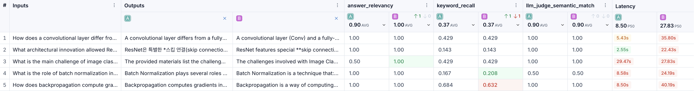

# Document RAG


PDF, HTML, DOCX 등 형식에 관계없이 문서를 Markdown으로 변환해 인덱싱하고, 출처와 함께 답하는 RAG(Retrieval-Augmented Generation) 시스템.
단순 답변 생성을 넘어 검색 품질 개선과 운영 제약(비용, Rate Limit, 저장소 한도) 해결에 집중했고, 전 과정을 무료 환경(API 무료 한도 + 로컬 모델)에서 구축했다.

검증은 공개 자료인 [CS231n](https://cs231n.github.io/) 강의 노트(스탠퍼드 강의)로 진행했다.

**핵심 목표**
- 다양한 형식의 문서를 하나의 검색 가능한 지식베이스로 통합
- 근거 없는 답변(Hallucination) 최소화
- 무료 환경에서도 지속 가능한 RAG 파이프라인 구축

---

## 아키텍처


인덱싱(서버 시작 시 1회)과 질의(매 요청)를 분리했고, 모든 실행은 LangSmith로 추적, 평가된다.

---

## 기술 스택

| 영역 | 선택 | 채택 근거 |
|---|---|---|
| 프레임워크 | LangChain (LCEL) | 검색-프롬프트-LLM을 파이프로 연결, 부품 교체만으로 A/B 실험 용이 |
| 전처리 | [markitdown](https://github.com/microsoft/markitdown) | 형식(PDF, HTML, DOCX)이 달라도 하나의 코드로 Markdown 통일 (Microsoft 오픈소스) |
| 청킹 | Markdown Header Splitter | 글자 수 분할은 섹션을 쪼개 검색 부정확 → 헤더 단위 분할로 의미 보존 |
| 임베딩 | 로컬 `BAAI/bge-m3` | Gemini 임베딩 일일 한도 초과로 재인덱싱 불가 → 로컬 전환으로 무제한, 무료, 다국어 지원 |
| 벡터 DB | Chroma `PersistentClient` | Cloud 무료 300 레코드 제한 → 로컬 디스크 영속 저장, 재실행에도 인덱스 재사용 |
| 생성 LLM | Gemini Flash / Ollama | 같은 코드로 교체해 품질·속도·비용 A/B 비교 |
| 서빙 | FastAPI + lifespan | 인덱싱은 시작 시 1회, 요청마다 검색·생성만 — 인덱싱↔생성 분리 |
| 평가 | LangSmith | 답변 품질을 Dataset 점수로 측정 + 실행 과정 추적 |

### 모델 구성

| 역할 | 모델 |
|---|---|
| 임베딩 | `BAAI/bge-m3` |
| 답변 생성 | `gemini-2.5-flash` or `gemma4:e4b` |
| 평가 Judge | `gemini-3.5-flash` |

---

## 주요 설계 결정

처음 계획과 실제 구현이 달라진 지점들. 제약이 설계를 바꾼 경우다.

| 결정 | 처음 계획 | 실제 선택 | 이유 |
|---|---|---|---|
| 임베딩 | Gemini API | 로컬 `bge-m3` | 일일 한도 초과 — 재인덱싱 불가, 실험 자체가 막힘 |
| 벡터 DB | Chroma Cloud | `PersistentClient` | 무료 300 레코드 → 청크 478개 초과 |
| 체인 생성 시점 | 요청마다 | 서버 시작 시 1회(`lifespan`) | 요청마다 임베딩·인덱싱 비용 발생 |
| 평가·서빙 공유 | 각자 구현 | `build_rag_chain()` 공통화 | 평가와 서빙이 다른 로직이면 점수가 품질을 보장하지 못함 |

---

## 프로젝트 구조

```
rag-project/
├── main.py            # FastAPI 진입점 (lifespan에서 체인 1회 구성)
├── rag.py             # RAG 엔진: 인덱싱 + 체인 (build_rag_chain / ingest)
├── routers/ask.py     # POST /ask 라우터
├── controllers/rag.py # 체인 호출 + 에러 처리
├── schemas.py         # 요청/응답 모델
├── baseline.py        # LangSmith 평가 스크립트
├── preprocess.py      # data/raw → markitdown → data/processed
├── data/              # raw(원본) & processed(md)   ← gitignore
├── chroma_data/       # 벡터 DB                      ← gitignore
├── docs/
└── pyproject.toml
```

---

## 평가 결과

`cs231n-rag-eval` (CS231n 핵심 개념 Q&A 5쌍)으로 세 지표를 측정한다. 

| 지표 | 의미 | 방식 |
|---|---|---|
| `keyword_recall` | 기대 답변의 핵심 내용어 회수율 | 휴리스틱(0~1) |
| `llm_judge_semantic_match` | 기대 답변과 의미 일치 여부 | LLM Judge(0 / 0.5 / 1) |
| `answer_relevancy` | 질문에 직접 대답하는지 | LLM Judge(0 / 0.5 / 1) |

**생성 모델 비교** (검색 전략 고정, 생성 모델만 교체)

| 생성 LLM | keyword_recall | llm_judge | answer_relevancy | latency(P50/P99) |
|---|---|---|---|---|
| gemini-2.5-flash (API) | 0.37 | 0.90 | 0.90 | 8.5s / 29.5s | 
| gemma4:e4b (로컬 ollama) | 0.37 | 0.90 | 1.00 | 27.8s / 40.2s | 



*Feedback Scores · Latency(P50/P99) · Token Count · Cost 비교 (A: gemini-2.5-flash vs B: gemma4:e4b)*

<details>
<summary>문항별 실측치 (latency)</summary>

| 문항 | gemini latency | gemma latency |
|---|---|---|
| Q1 Conv vs FC layer | 5.4s | 35.8s |
| Q2 ResNet 혁신 | 2.6s | 22.4s |
| Q3 이미지 분류 과제 | 29.5s  | 27.8s |
| Q4 배치 정규화 역할 | 8.6s | 24.2s |
| Q5 역전파 그래디언트 계산 | 8.5s  | 40.2s |


</details>

---

## 트러블슈팅

| 문제 | 원인 | 해결 |
|---|---|---|
| Gemini 임베딩 429 / 일일 한도 | 청크 수만큼 API를 호출해 무료 한도 소진 | 로컬 `bge-m3`로 전환 |
| Chroma Cloud 저장 실패 | 무료 티어 300 레코드 → 청크 478개 초과 | `PersistentClient`(로컬 디스크) |
| Q3 "자료에서 확인 불가" | CS231n의 `**Challenges**` 볼드 헤더를 Splitter가 인식 못해 청크 맥락 소실 | `_inject_header_context`로 서브청크에 헤더 경로 재주입하여 개선 |
| 요청마다 인덱싱 반복 | 체인을 요청 시마다 새로 생성 | `lifespan`으로 서버 시작 시 1회만 구성, `app.state`에 보관 |

---

## 실행 방법

```bash
uv sync
cp .env.example .env          # 본인 키 입력 (실제 키 커밋 금지)

uv run python preprocess.py   # data/raw/* → data/processed/*.md
uv run python rag.py          # 인덱싱 (chroma_data 생성)
uv run uvicorn main:app --reload   # 서버 (http://localhost:8000/docs)
uv run python baseline.py     # 평가
```

`/docs`에서 API 스펙과 예시 요청을 바로 확인할 수 있다. 답변은 질문 언어를 따른다(한국어 질문 → 한국어 답변). 에러: 빈 질문 `422` / 검색 0건 `404` / LLM 실패 `500`.

---

## 앞으로 개선할 점

- **리랭커 추가** — 검색 수(k)를 크게 늘리고 리랭커로 재정렬해 정밀도 개선
- **RAGAS 도입** — faithfulness, context_precision 등 더 다양한 지표로 평가
- **Judge 분리** — 프론티어 모델로 자가평가 편향 제거
- **코퍼스 확장** — 더 다양한 문서로 확장 (Phase 2)
- **Agentic RAG** — LangGraph 기반 다단계 검색, 추론 (Phase 3)

---

## 회고

[7주차 회고](docs/retro-week7.md)
