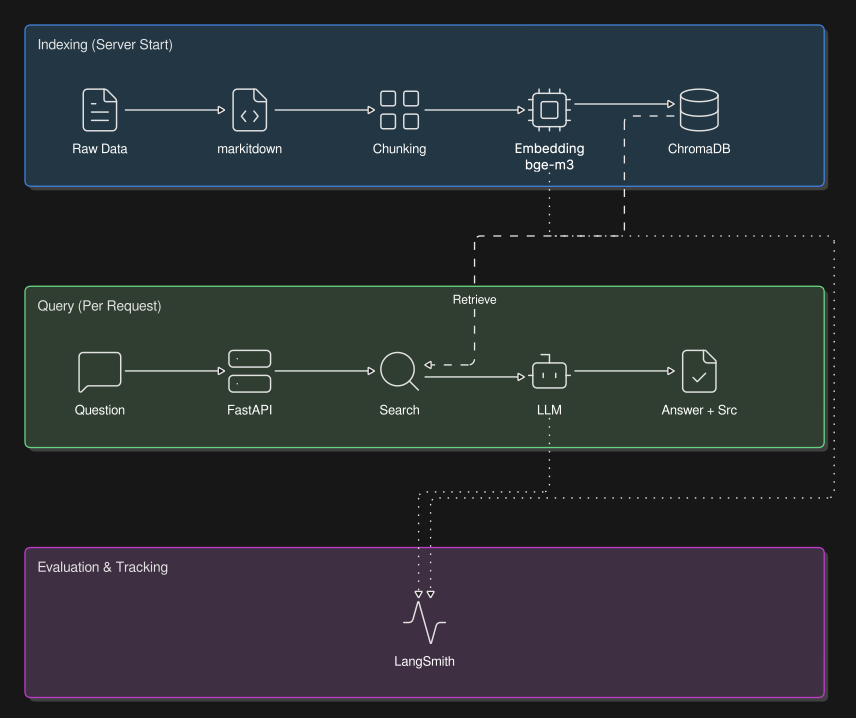

# Document RAG


PDF·HTML·DOCX 등 형식에 관계없이 문서를 Markdown으로 변환해 인덱싱하고, 출처와 함께 답하는 RAG(Retrieval-Augmented Generation) 시스템.
단순 답변 생성을 넘어 검색 품질 개선과 운영 제약(비용, Rate Limit, 저장소 한도) 해결에 집중했고, 전 과정을 무료 환경(API 무료 한도 + 로컬 모델)에서 구축했다. 

검증은 공개 자료인 [CS231n](https://cs231n.github.io/) 강의 노트(스탠퍼드 CNN 강의)로 진행했다.

**핵심 목표**
- 다양한 형식의 문서를 하나의 검색 가능한 지식베이스로 통합
- 근거 없는 답변(Hallucination) 최소화
- 무료 환경에서도 지속 가능한 RAG 파이프라인 구축

---

## 아키텍처



인덱싱(서버 시작 시 1회)과 질의(매 요청)를 분리했고, 모든 실행은 LangSmith로 추적, 평가된다.

---

## 기술 스택

| 영역 | 선택 | 채택 근거 |
|---|---|---|
| 프레임워크 | LangChain (LCEL) | 검색·프롬프트·LLM을 파이프로 연결, 부품 교체만으로 A/B 실험 용이 |
| 전처리 | [markitdown](https://github.com/microsoft/markitdown) | 형식(PDF·HTML·DOCX)이 달라도 하나의 코드로 Markdown 통일 (Microsoft 오픈소스) |
| 청킹 | Markdown Header Splitter | 글자 수 분할은 섹션을 쪼개 검색 부정확 → 제목(헤더) 단위 분할로 의미 보존 |
| 임베딩 | 로컬 `BAAI/bge-m3` | 인덱싱 시 청크 수만큼 호출 → API 무료 한도 초과 → 로컬 모델로 무제한, 무료 + 다국어 지원 |
| 벡터 DB | Chroma `PersistentClient` | Cloud 무료는 300 레코드 제한 → 서버 없이 디스크에 영속 저장해 재실행에도 인덱스 재사용 |
| 생성 LLM | Gemini Flash / Ollama | API(속도)/로컬(무료, 오프라인)을 같은 코드로 교체해 품질·비용 비교 |
| 서빙 | FastAPI + lifespan | 무거운 인덱싱은 시작 시 1회, 요청마다는 검색·생성만 — 인덱싱↔생성 분리 |
| 평가 | LangSmith | 답변 품질을 Dataset 점수로 측정 + 실행 과정 추적 |

### 모델 구성

| 역할 | 모델 |
|---|---|
| 임베딩 | `BAAI/bge-m3` |
| 답변 생성 | `gemini-2.5-flash` or `gemma4:e4b` |
| 평가 Judge | `gemini-3.5-flash` |

---

## 프로젝트 구조

```
rag-project/
├── main.py            # FastAPI 진입점 (lifespan에서 체인 1회 구성)
├── rag.py             # RAG 엔진: 인덱싱 + 체인 (build_rag_chain / ingest)
├── routers/ask.py     # POST /ask 라우터
├── controllers/rag.py # 체인 호출 + 에러 처리
├── schemas.py         # 요청/응답 모델
├── baseline.py        # LangSmith 평가 스크립트
├── preprocess.py      # data/raw → markitdown → data/processed
├── data/              # raw(원본) & processed(md)   ← gitignore
├── chroma_data/       # 벡터 DB                      ← gitignore
├── docs/
└── pyproject.toml
```

---

## 평가 결과

`cs231n-rag-eval` (CS231n 핵심 개념 Q&A 5쌍)으로 세 지표를 측정한다.

| 지표 | 의미 | 방식 |
|---|---|---|
| `keyword_recall` | 기대 답변의 핵심 내용어 회수율 | 휴리스틱(0~1) |
| `llm_judge` | 기대 답변과 의미 일치 여부 | LLM Judge(0 / 0.5 / 1) |
| `answer_relevancy` | 질문에 직접 대답하는지 | LLM Judge(0 / 0.5 / 1) |

**LLM 모델 비교** (문항 5개 평균)

| 생성 LLM | k | keyword_recall | llm_judge | answer_relevancy | latency(P50) |
|---|---|---|---|---|---|
| gemini-2.5-flash (API) | 5 | 0.37 | 0.90 | 0.90 | 8.5s |
| gemma4:e4b (로컬 ollama) | 5 | 0.37 | 0.90 | 1.00 | 27.8s |

---

## 실행 & 사용

```bash
uv sync
cp .env.example .env          # 본인 키 입력 (실제 키 커밋 금지)

uv run python preprocess.py   # data/raw/* → data/processed/*.md 
uv run python rag.py          # 인덱싱 (chroma_data 생성)
uv run uvicorn main:app --reload   # 서버 (http://localhost:8000/docs)
uv run python baseline.py     # 평가
```

**요청 / 응답 예시**

```http
POST /ask
{ "question": "이미지 분류의 주요 과제가 뭐야?" }
```

```json
{
  "answer": "이미지 분류의 주요 과제는 시점 변화, 조명, 변형, 가림, 배경 혼잡, 클래스 내 변이 등으로 ...",
  "sources": ["data/processed/classification.md"]
}
```

답변은 질문 언어를 따른다(한국어 질문 → 한국어 답변). 

에러: 빈 질문 `422` / 검색 0건 `404` / LLM 실패 `500`.

---

## 회고


