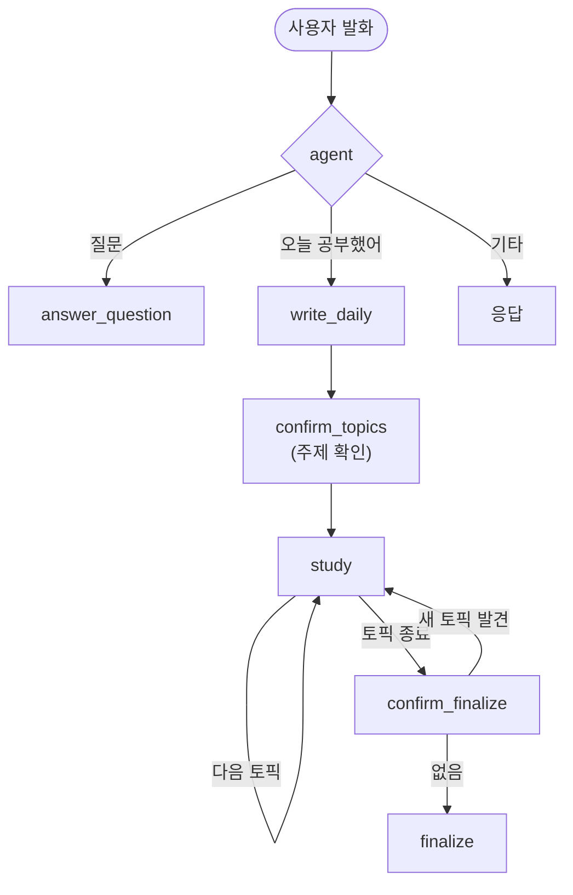
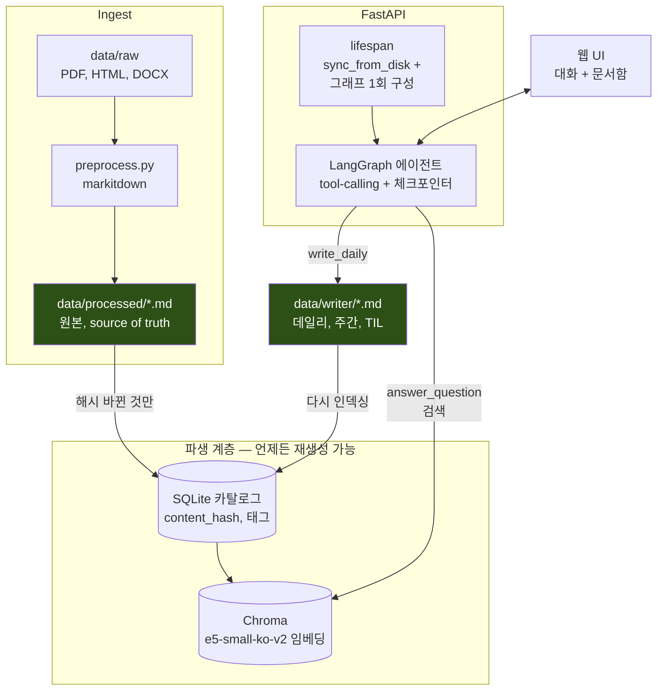

# Knowledge Gardener


> **요약해주는 AI는 학습을 대신해준다.**
> Knowledge Gardener는 **요약하지 않고 되묻는다.**

<!-- TODO: Demo GIF -->

```
🧑 오늘 Transformer 공부했어. 정리해줘.

일반적인 AI
🤖 Transformer는 Self-Attention을 사용하는...

Knowledge Gardener
🤖 Transformer를 본인 말로 설명해주실 수 있나요?

🧑 각 단어 사이의 관련도를 계산하는...

🤖 왜 관련도를 계산해야 하나요?
   순서대로 처리하면 안 되는 이유는 무엇일까요?
```

설명해낸 내용은 학습 노트로 저장하고,

설명하지 못한 개념은 **🌱 Seedling**으로 남긴다.

이 기록은 다시 Knowledge Base에 편입되어,
다음 학습과 질문의 출발점이 된다.

---

## Problem

학습자는 내용을 읽거나 정리한 직후에는 **이해했다고 느끼기 쉽습니다.**

하지만 자신의 말로 다시 설명하려 하면,
어디를 이해하지 못했는지 드러납니다.

기존 AI 학습 도구는 이러한 빈틈을
그럴듯한 요약으로 메워버리기 쉽습니다.

Knowledge Gardener는 사용자의 빈칸을 대신 채우지 않습니다.

교육학 연구(Dunlosky et al., 2013)에 따르면,

- **Retrieval Practice (인출 연습)**
- **Spaced Repetition (분산 복습)**

은 높은 학습 효과를 보이는 반면,

- **Summarization (요약)**
- **Rereading (재독)**

은 상대적으로 효과가 낮다고 보고됩니다.

그래서 Knowledge Gardener는

- 사용자가 먼저 설명하도록 질문하고,
- 설명하지 못한 개념은 보완하지 않은 채 **🌱 Seedling**으로 남깁니다.

> **답을 잘 만들어주는 AI가 아니라, 사용자가 먼저 꺼내 말하도록 설계된 학습 루프를 목표로 합니다.**


---

## Design Principles

| 원칙 | 시스템에서 어떻게 구현했는가 |
|------|---------------------------|
| 설명은 사용자가 한다 | `write_daily`는 질문만 생성하며, 답을 대신 작성하지 않는다. |
| 시작할 주제도 사용자가 정한다 | `write_daily`가 뽑은 주제를 그대로 쓰지 않고, `confirm_topics` 단계에서 사용자가 확인·선택한 것만 세션에 남긴다. |
| 모르면 채우지 않는다 | 설명하지 못한 개념은 보완하지 않고 **🌱 Seedling**으로만 기록한다. |
| 얕은 이해는 더 묻는다 | 설명이 피상적이면 반드시 후속 질문을 생성한다. |
| 사용자 확인 후 저장한다 | 마지막 토픽에서도 바로 저장하지 않고 반드시 저장 여부를 확인한다. |

---

## Learning Loop

인출 연습은 질문 하나로 끝나지 않습니다.

사용자의 답변에 따라

- 더 깊이 설명하도록 질문하거나,
- 다음 주제로 넘어가거나,
- 설명하지 못한 개념을 **🌱 Seedling**으로 남기거나,
- 모든 주제가 끝난 뒤 저장 여부를 확인해야 합니다.

Knowledge Gardener는 이 흐름을 **LangGraph 기반의 상태 머신(State Machine)** 으로 관리합니다.

학습 세션은 다섯 가지 상태를 오가며 진행됩니다.

- **awaiting_topic_confirm** : 추출된 주제를 사용자가 확인/선택하는 단계
- **pending** : 아직 설명하지 않은 토픽
- **answered** : 충분히 설명한 토픽
- **seedlings** : 다시 복습할 토픽
- **awaiting_finalize** : 저장 여부를 확인하는 단계



학습 세션이 끝나면 결과는 Daily Note, Weekly Note, TIL로 저장되며,

저장된 기록은 다시 Knowledge Base에 편입되어 이후 질문의 검색 근거가 됩니다.

---

### Grounded Question Answering

Knowledge Gardener는 저장된 학습 기록을 기반으로 **출처 기반(RAG) 질의응답**을 제공합니다.

`answer_question`은 Dense 검색(`dragonkue/multilingual-e5-small-ko`)과 BM25(`kiwipiepy`) 검색 후보를 함께 모아 cross-encoder(`BAAI/bge-reranker-base`)로 재점수합니다. 재점수된 top-1 문서가 임계값(`RELEVANCE_THRESHOLD`, 환경변수로 조정 가능)을 넘지 못하면 질문을 다시 작성해 최대 **2회까지 재검색**하고, 충분한 근거가 확보되었을 때만 답변을 생성합니다.

문서함에서 특정 문서를 펼쳤을 때는 전체 코퍼스가 아니라 **그 문서 하나만을 근거로** 답하는 별도의 질의응답(`POST /documents/{doc_id}/ask`)도 제공합니다. 이 경로는 검색이나 세션 상태 없이 문서 본문만 컨텍스트로 받는 stateless 함수(`answer_document_question`)로 동작합니다.

---

## Architecture

Knowledge Gardener는 **Markdown을 Source of Truth**로 유지하는 구조를 채택했습니다.

SQLite와 Chroma는 모두 Markdown으로부터 언제든 재생성 가능한 **파생 데이터(Derived Data)** 이며,
문서가 변경되면 변경된 파일만 자동으로 재인덱싱합니다.



---

## Engineering Decisions

| 영역   | 선택                                                                                  | 채택 이유                                                                              |
| ---- | ----------------------------------------------------------------------------------- | ---------------------------------------------------------------------------------- |
| 에이전트 | LangGraph `StateGraph` + Tool Calling + Checkpointer                                | 인출 학습은 반복 질문, 조건 분기, 저장 확인 등 멀티턴 상태 관리가 핵심이므로 상태 머신 기반으로 구현했다.                     |
| 전처리  | `markitdown` + Markdown Header Splitter                                             | 다양한 문서를 Markdown으로 통일하고, 헤더 단위 Chunking으로 검색 시 문맥을 유지한다.                           |
| 인덱스  | SQLite Catalog + ChromaDB                                                           | 변경 감지와 메타데이터 관리는 SQLite, 의미 기반 검색은 Chroma가 담당한다. 두 저장소 모두 Markdown으로부터 재생성 가능하다.   |
| 임베딩  | `dragonkue/multilingual-e5-small-ko-v2`                                             | `bge-m3`는 EC2 t3.small 환경에서 OOM이 발생했다. 더 작은 한국어 특화 모델로 교체한 뒤 자체 벤치마크로 검색 품질을 확인했다. |
| 검색   | Dense + BM25 후보를 cross-encoder(`bge-reranker-base`)로 재점수                            | Dense-only가 놓치는 키워드 매칭을 보완하기 위해 하이브리드를 도입했다.                                       |
| LLM  | 생성: Cerebras `gemma-4-31b` → Claude `Haiku 4.5` (Fallback)<br>평가: Claude `Sonnet 5` | 생성과 평가 모델을 분리해 보다 안정적으로 품질을 검증한다.                                                  |
| 서빙   | FastAPI Lifespan                                                                    | 애플리케이션 시작 시 그래프를 한 번만 초기화해 요청마다 재생성하지 않는다.                                         |
| 관측   | LangSmith + `elapsed_ms` Logging                                                    | Retrieval, Tool Calling, Latency를 함께 추적해 병목과 품질을 분석한다.                             |
| 배포   | Docker Compose + EC2                                                                | App과 Chroma를 분리하고 Named Volume으로 데이터를 유지한다.                                        |

---

## Run

### Docker (Recommended)

```bash
cp .env.example .env
docker compose up --build
```

### Local Development

```bash
uv sync

cp .env.example .env

uv run python scripts/preprocess.py
uv run fastapi dev app/main.py
```

별도의 인덱싱 명령은 존재하지 않습니다.

애플리케이션 시작 시

- `sync_from_disk()`
- `sync_index()`

가 자동 실행되어

- 변경된 문서만 탐지하고,
- 필요한 문서만 재임베딩합니다.

전체 인덱스를 다시 생성하지 않고 증분 동기화만 수행하도록 설계했습니다.

---

## Project Structure

```text
app/
├── main.py               # FastAPI entrypoint
├── api/routes/           # REST API
├── rag/
│   ├── graph.py          # LangGraph workflows
│   ├── nodes.py          # Graph nodes
│   ├── study_session.py  # Retrieval Practice state machine
│   ├── tools.py          # Agent tools
│   └── chain.py          # RAG pipeline / Index sync
├── core/catalog.py       # SQLite catalog
├── schemas/              # Pydantic request/response 모델
├── services/             # 라우트 ↔ 그래프 사이 서비스 레이어
├── writer/               # Daily / Weekly / TIL
└── visualizer/           # Mindmap

scripts/
├── preprocess.py
├── backfill_catalog.py
├── baseline.py
├── benchmark.py
├── eval_retrieval.py
└── gen_evalset.py

tests/                     # pytest

static/
└── Web UI
```

---

## Roadmap

| 계획                     | 이유                                                                    |
| ---------------------- | --------------------------------------------------------------------- |
| 🌱 Seedling 기반 분산 복습   | 지금은 데일리노트에 기록되고 사이드바에 노출되기만 한다 — 일정 간격으로 실제로 다시 물어보는 경험까지 완성하기 위해     |
| 문서 업로드 API             | 배포 환경에서도 브라우저만으로 문서를 추가할 수 있도록 인제스트 경로를 확장하기 위해                       |
| Retrieval Benchmark 공개 | Hit Rate, MRR 등 검색 품질과 튜닝 과정을 재현 가능하게 문서화하기 위해                        |
| End-to-End 평가 자동화      | LangSmith 기반 평가를 CI에 포함해 변경 사항이 답변 품질에 미치는 영향을 지속적으로 검증하기 위해          |
| 사용자 피드백 기반 개선          | 👍/👎 피드백을 평가셋으로 축적해 Retrieval과 Prompt를 지속적으로 개선하기 위해                 |

